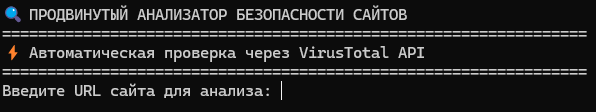
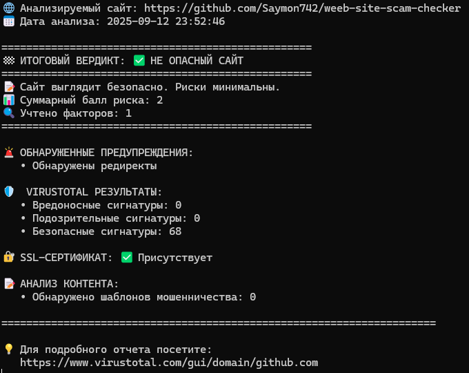

hello, user! <3

I created this project to check suspicious websites for phishing, viruses, etc.

This project uses VirusTotal, as well as its own methods for checking for scams.

<h1>HOW TO USE THIS TOOL FILE?</h1>

1.Install all dependencies with the command **"pip install -r requirements.txt"**

2.To get started, run the **.bat** file

  which will create all the necessary files as well as the .exe file itself.

After the process of creating all the files is complete, go to the **dist** folder and run the **.exe** file located there.

After launching, you will see a field for entering the **URL** of the site you want to check.

After checking, it will show you all its dangers, contact numbers, and the results of the *VirusTotal* check.
